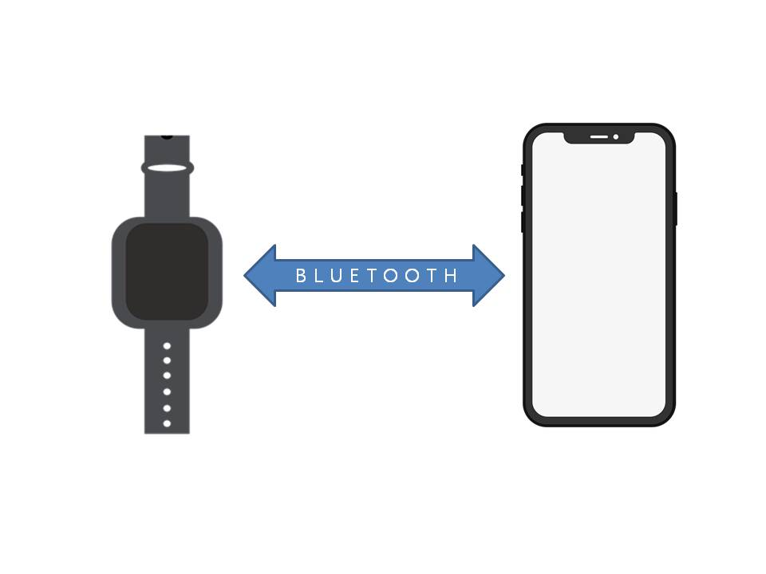
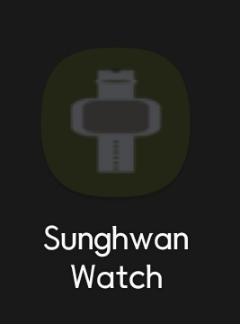
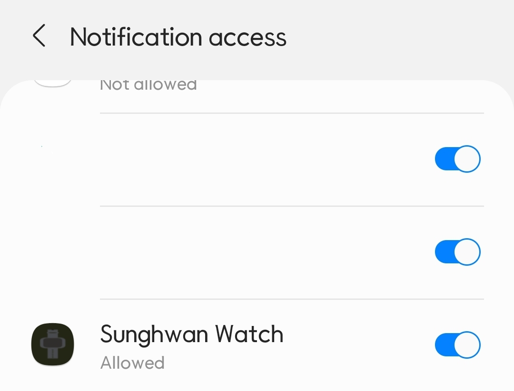
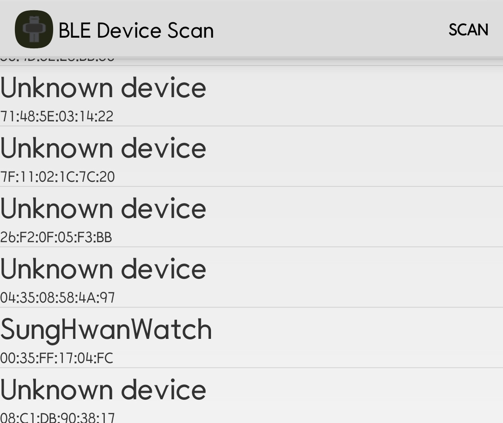

# Sunghwan OledWatch Android Application

OlwdWatch와 연동되는 **Companion App** 입니다.   

## Accessories  

About Wiki Page : [wiki-page](https://RuffaloLavoisier.github.io/OledWatch-Wiki)  

About Device    : [device](https://github.com/RuffaloLavoisier/OledWatch-Device)

### About Android Guide

  

[여기를](https://ruffalolavoisier.github.io/OledWatch-Wiki/Developer/deviceApp/) 보면 안드로이드와 손목시계 디바이스가 연동하는 것에 관한 가이드와 설명 페이지가 갖추어져 있습니다.

## APP

  

>1. 앱을 실행합니다.  

  

>2. 메신저 알림을 읽기 위해서는 **앱 접근 권한**이 필요합니다.  
>* 추가로 **위치 권한** (Location Permission)허용이 필요합니다.  

  

>3. 블루투스 검색 목록에서 해당하는 디바이스를 찾아서 연결합니다.  

## Special

1. 손목시계와 연결하기  
2. 손목시계 탑재된 RGB 모듈을 제어
3. 손목시계 위치를 Buzzer를 이용해 확인
4. RSSi와 구글맵을 연동하여 위치를 지도에 표시(상호간 거리 알림)
5. 스마트폰 PUSH 알림 전송
